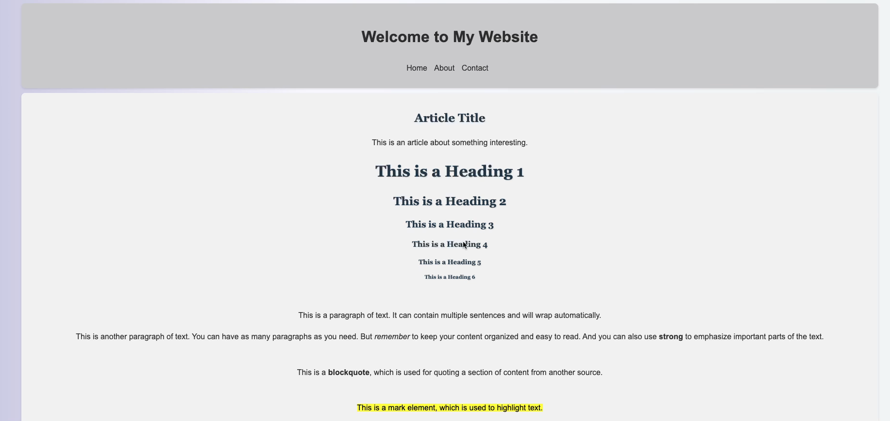
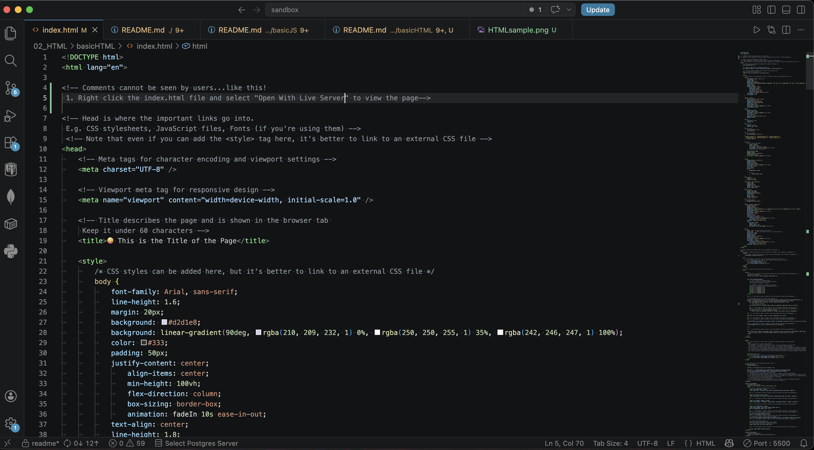

# Welcome to Basic HTML =>Tutorial Template

## What is this Basic HTML Directory?
* 💼 This directory serves as a reference or tutorial for basic HTML.
* 🤔 It covers:
	* 🕸️ Basic **HTML Elements**
	* 🎨 Basic **Inline Style CSS**
	* 🤔 HTML Structure and tutorials
		* 🖼️ **Comments:** serve as tips and guidance for each element 
		* 💻 **Open with the Live Server:** to view the page

 

# HTML Tutorial Template

* 😪 A lightweight starter HTML template for frontend projects or for a quick HTML reference

* 🏋🏼 Built with:
	* 🕸️ Semantic HTML
	* 🎨 Responsive layout

 

 

 

## ✨ Features

* Responsive design (mobile-first)
* Accessible markup (semantic elements, skip link, ARIA where needed)
* Clean, reusable CSS structure even if it is Inline Style
* You can use this as a basic HTML Template or reference

## 🧠 Notes

* This template has no frameworks or build tools
* Designed for quick prototypes, and reference
* Easily extendable if you later want to add tooling or a framework

---

## 📄 License

This project is licensed under the MIT License.
